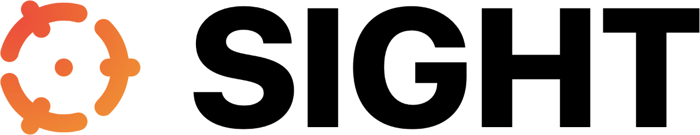

<p align="center">
    
</p>

<p align="center">
    
    <a href="https://github.com/zntfdr/Sight/actions?query=workflow%3A%22Build+and+Test%22">
        
    </a>
    <a href="https://swift.org/package-manager">
        
    </a>
     
    <a href="https://twitter.com/zntfdr">
        
    </a>
</p>

Welcome to **Sight**, a Swift spatial search μlibrary. Its primary goal is to extend Apple's [`GameplayKit`](https://developer.apple.com/documentation/gameplaykit) framework.

## Usage

Sight helps you quickly determine which object is closest to a given position.

This is done via a `Region` instance, which represents the space where all the objects are positioned in.

```swift
import Sight

// Define a region with bounds and search radius.
let region = Region<String>(
  minBounds: SIMD2(x: 0, y: 0), 
  maxBounds: SIMD2(x: 1, y: 1), 
  searchRadius: 0.3
)

// Place objects in the region.
region.add("A", at: SIMD2(x: 0, y: 0.1))
region.add("B", at: SIMD2(x: 0.5, y: 0))
region.add("C", at: SIMD2(x: 0, y: 0.8))

// Find the closest object to any position.
region.closestValue(to: SIMD2(x: 0.5, y: 0.2)) // "B" 
region.closestValue(to: SIMD2(x: 1, y: 0)) // nil 
```

`Region` is optimized for spatial searches, this is why during its initialization both search radius and its bounds are required.

You can find many more examples in the [`Tests`](https://github.com/zntfdr/Sight/tree/master/Tests) folder.
  
## Installation

Sight is distributed using the [Swift Package Manager](https://swift.org/package-manager). To install it into a project, follow [this tutorial](https://developer.apple.com/documentation/swift_packages/adding_package_dependencies_to_your_app) and use this repository URL: `https://github.com/zntfdr/Sight.git`.

## Credits

Sight was built by [Federico Zanetello](https://twitter.com/zntfdr) as a component of [Bangkok Metro](http://yourmetro.app).

If you'd like to know more on how this library works, please refer to `GameplayKit`'s [`GKQuadtree` overview](https://developer.apple.com/documentation/gameplaykit/gkquadtree).

## Contributions and Support

All users are welcome and encouraged to become active participants in the project continued development — by fixing any bug that they encounter, or by improving the documentation wherever it’s found to be lacking.

If you'd like to make a change, please [open a Pull Request](https://github.com/zntfdr/Sight/pull/new), even if it just contains a draft of the changes you’re planning, or a test that reproduces an issue.

Thank you and please enjoy using **Sight**!
